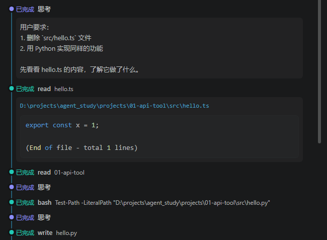
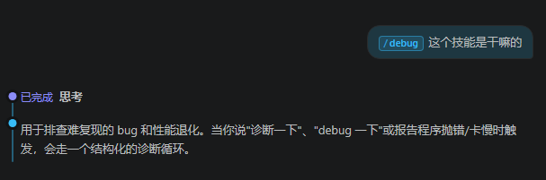
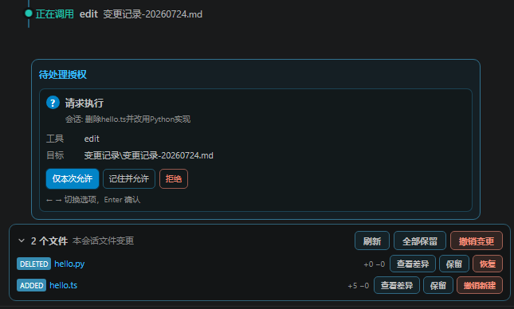
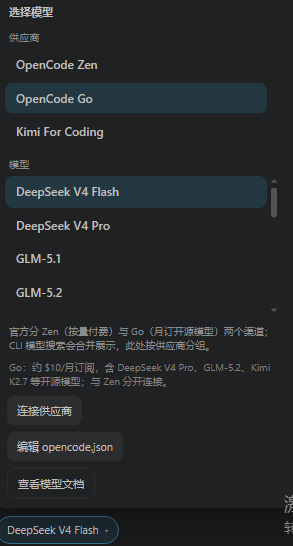
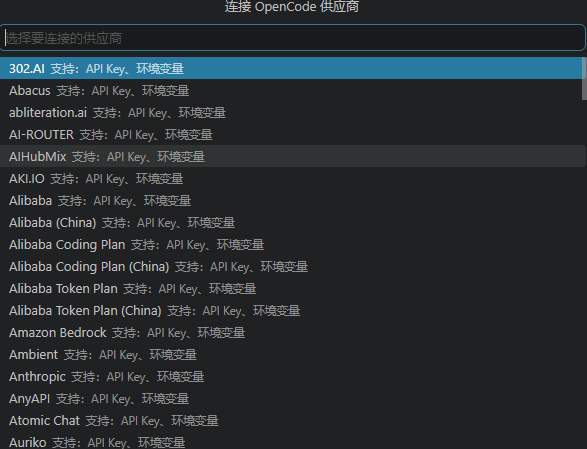
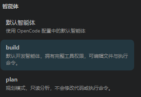
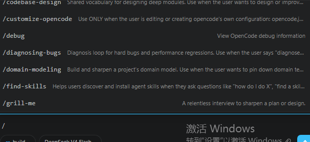

# OpenCode for VS Code — 社区版

[](https://github.com/1998moye/opencode-for-vscode-community)

在 VS Code 里使用你**自行安装的 [OpenCode CLI](https://opencode.ai/)** 与官方 Server API 的原生图形客户端。本扩展为社区维护，**与 OpenCode 官方无隶属或背书关系**。

**仓库地址：** https://github.com/1998moye/opencode-for-vscode-community

---

## 功能概览

- 检测本机 OpenCode CLI（最低 **1.17.0**），在受信任工作区启动带随机密码的本机 Server，或连接外部 / 远程服务。
- 右侧辅助栏与编辑器标签页共享同一会话：聊天、流式回复、工具调用时间线、权限确认、变更审查与回退。
- 模型与智能体选择、`/` 技能补全、会话管理（新建 / 重命名 / 删除、重发与编辑提示）。
- 简体中文与英文界面（设置项 `opencodeCommunity.language`）。

---

## 安装

> **扩展 ID 须为 `Dingzhen.opencode-for-vscode-community`**。若发布者显示为 `dz` 等其它名称，是旧包，请先卸载再安装本仓库生成的 VSIX。

### 方式一：安装 VSIX（推荐尝鲜）

1. 在 [Releases](https://github.com/1998moye/opencode-for-vscode-community/releases) 下载最新 `opencode-for-vscode-community-*.vsix`（或本地 `npm run package` 生成）。
2. VS Code：**扩展** → 右上角 `…` → **从 VSIX 安装…**

### 方式二：从源码构建

**前置条件**

| 依赖 | 版本 |
|------|------|
| [OpenCode CLI](https://opencode.ai/) | ≥ 1.17.0 |
| Node.js | ≥ 20 |
| VS Code | ≥ 1.106 |

```powershell
git clone https://github.com/1998moye/opencode-for-vscode-community.git
cd opencode-for-vscode-community
npm install
npm run build
```

- 按 `F5` 启动扩展开发宿主，或执行 `npm run package` 得到 VSIX。

---

## 快速开始

1. **安装并配置 OpenCode CLI**（模型、供应商等写在用户目录或工作区的 `opencode.json`，扩展不会替你保存 API Key 到仓库）。
2. 打开**受信任**工作区；点击活动栏 **OpenCode 社区版**（官方「O」标识）或编辑器标题栏聊天图标，打开右侧聊天。
3. 若未连上服务：命令面板执行 **「OpenCode 社区版：重新检测并连接」**。
4. 底栏选择 **智能体**（如 `build` / `plan`）与 **模型**；输入消息或输入 `/` 使用技能。

常用命令（命令面板搜索 `OpenCode 社区版`）：

| 命令 | 说明 |
|------|------|
| 打开右侧聊天 | 聚焦辅助侧栏 Webview |
| 在编辑器中打开聊天 | 独立标签页，与会话共享 |
| 新建会话 | 清空当前表面并创建新会话 |
| 连接模型供应商 | 引导配置 API Key / 环境变量 |
| 编辑 opencode.json | 打开工作区或全局配置 |
| 设置外部服务密码 | 外部 Server 的 Basic Auth（存于 VS Code 密钥库） |

编辑器右键：将选区加入聊天、在新会话中提问、修复诊断、审查选区等。

---

## 使用说明（界面导览）

### 工具调用与时间线

助手执行 read / write / bash 等工具时，会在聊天区展示步骤时间线，便于跟踪进度。



### 斜杠技能与 /debug

输入 `/` 可补全 OpenCode 技能；例如 `/debug`、诊断类技能用于结构化排查难复现问题与性能退化。



### 权限与变更审查

敏感工具调用会弹出**请求执行**；会话产生的文件增删改集中在**本会话文件变更**，可逐文件查看差异、保留或撤销，并支持批量操作。



### 模型选择

底栏打开模型面板，按供应商分组选择模型，并可跳转连接 Zen / Go 或第三方供应商。



### 连接供应商

通过列表选择供应商，按提示配置 **API Key** 或**环境变量**（凭据由 OpenCode 管理，勿写入本仓库）。



### 智能体模式

- **build**：完整工具权限，可改文件与执行命令。  
- **plan**：只读分析，不修改代码、不执行命令。



### 技能列表



---

## 连接拓扑（高级）

在 VS Code 设置中搜索 **OpenCode 社区版**：

- **managed-local**（默认）：扩展在本机 `127.0.0.1` 启动并管理 Server。  
- **external-same-filesystem** / **external-remote**：连接已有 Server；远程需配置路径映射，未完成探测时文件类能力会降级禁用。

非回环地址须使用 **HTTPS**；外部服务密码通过命令写入 VS Code **Secret Storage**。

详见 [产品需求文档](docs/产品需求文档.md)。

---

## 发布到 GitHub 时请注意

本仓库**只应包含可构建运行的源码**，请勿提交：

- `node_modules/`、`dist/`、`*.vsix`（已在 `.gitignore`）  
- `.env`、密钥、证书  
- 含 API Key 的 **`opencode.json`**（工作区或用户目录中的真实配置）  
- 个人路径截图中的敏感信息（文档用图见 `docs/images/`）

克隆后执行 `npm install && npm run build` 即可运行。图标说明见 [media/BRAND.md](media/BRAND.md)。

---

## 开发

```powershell
npm run typecheck
npm test
npm run build
npm run package
```

贡献请遵守 [docs/开发规范.md](docs/开发规范.md)（单一职责模块、`OpenCodeRuntime` 测试接缝等）。

## 安全边界

- 扩展**不会**安装或升级 OpenCode。  
- 受管本机服务仅监听 `127.0.0.1`，并使用随机 Basic Auth。  
- Provider 凭据由 OpenCode 保存；外部 Server 密码在 VS Code 密钥库。  
- **未信任**工作区不会启动 Agent 或读取工作区内容。

## 许可证

MIT
